Visualizing Time Series Data in R
================

## GitHub Documents

This is an R Markdown format used for publishing markdown documents to
GitHub. When you click the **Knit** button all R code chunks are run and
a markdown file (.md) suitable for publishing to GitHub is generated.

## Including Code

    ##            yahoo microsoft citigroup dow_chemical
    ## 2015-01-02 50.17  44.30501  53.45259     42.48209
    ## 2015-01-05 49.13  43.89759  51.76803     41.16821
    ## 2015-01-06 49.21  43.25329  49.94556     40.50662
    ## 2015-01-07 48.59  43.80284  50.40857     40.44139
    ## 2015-01-08 50.23  45.09144  51.16711     41.44776
    ## 2015-01-09 49.72  44.71244  50.02437     41.38253

    ## [1] "yahoo"        "microsoft"    "citigroup"    "dow_chemical"

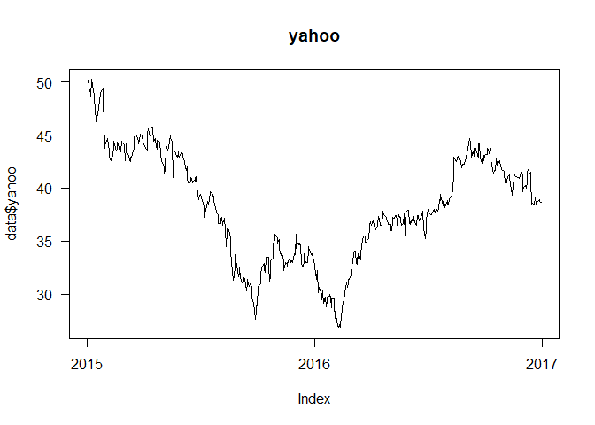<!-- -->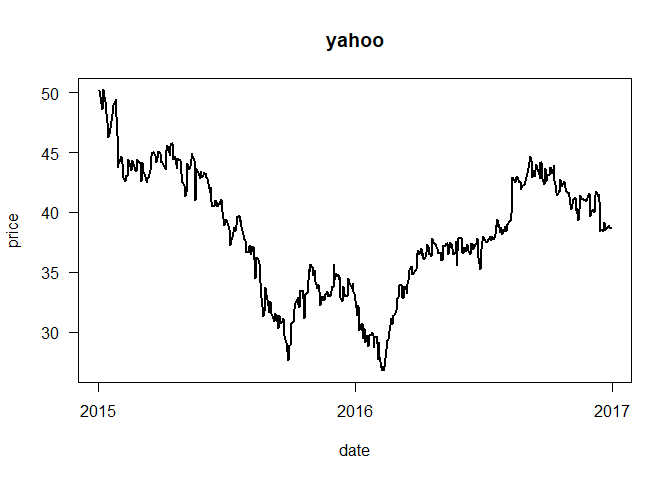<!-- -->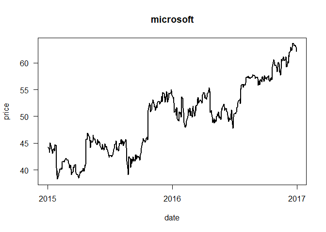<!-- -->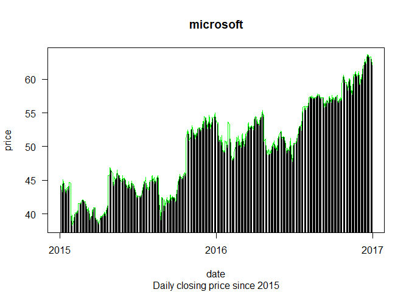<!-- -->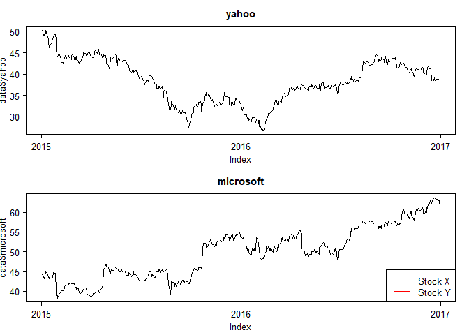<!-- -->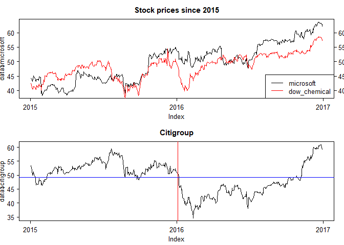<!-- -->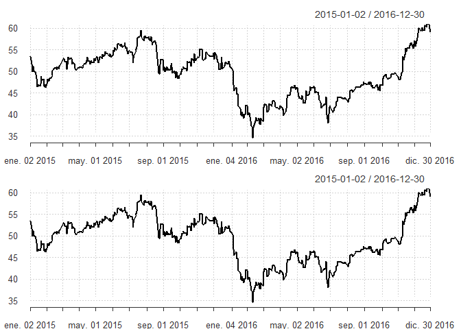<!-- -->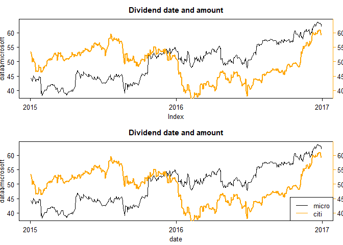<!-- -->

    ## [1] "Index" "Apple"

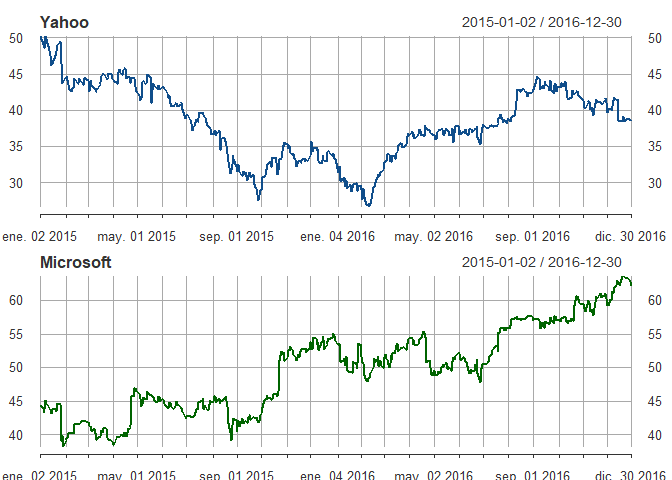<!-- -->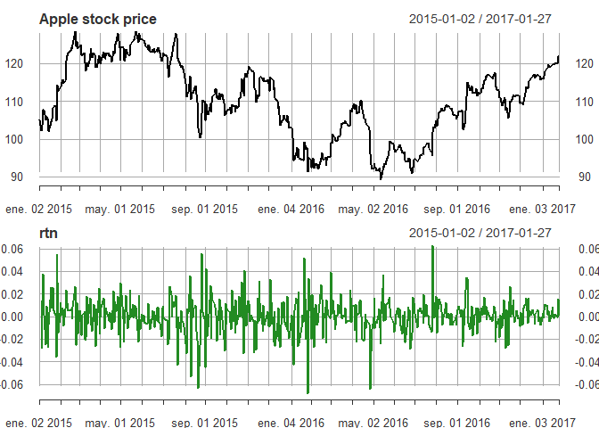<!-- -->

    ## [1] "xts" "zoo"

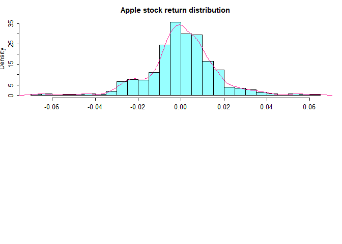<!-- -->
