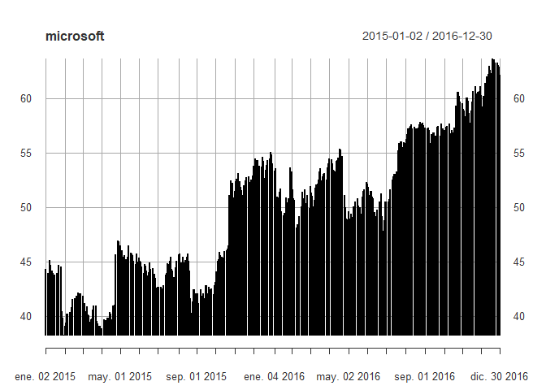

Visualizing Time Series Data in R
================
Raquel Arcos Bulos

## Contenido del curso

Este documento recopila las gráfica que se generan en el curso
*Visualizing Time Series Data in R* de DataCamp.  
Como todos los cursos de DataCamp es de excelente calidad.

## Los datos

El primer archivo contiene los precios de acciones diarios de cuatro
importantes compañías: Microsoft, Yahoo, Citigroup y Dow Chemical en el
periodo enero-2015 a diciembre 2016. A continuaciòn se presentan las
series de tiempo contrastando los precios vs las fechas.

    ##            yahoo microsoft citigroup dow_chemical
    ## 2015-01-02 50.17  44.30501  53.45259     42.48209
    ## 2015-01-05 49.13  43.89759  51.76803     41.16821
    ## 2015-01-06 49.21  43.25329  49.94556     40.50662

    ##            yahoo microsoft citigroup dow_chemical
    ## 2016-12-28 38.73     62.99  59.86861        57.90
    ## 2016-12-29 38.64     62.90  59.21050        57.42
    ## 2016-12-30 38.67     62.14  59.26035        57.22

<!-- --><!-- -->

<!-- -->

<!-- -->
<!-- -->

<!-- --><!-- -->

<!-- --><!-- -->

    ## [1] "Index" "Apple"

<!-- -->

<!-- -->

<!-- -->

    ## [1] "xts" "zoo"
